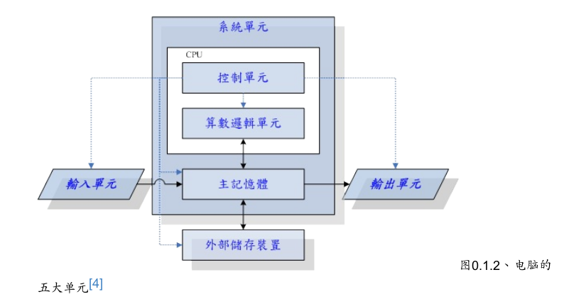
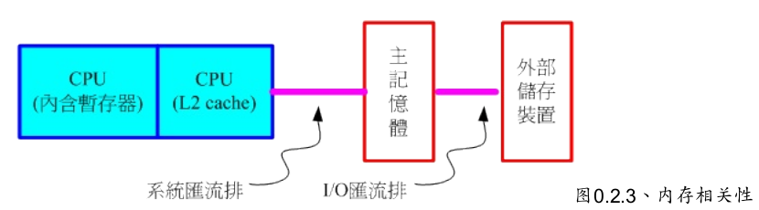
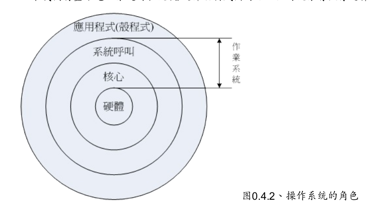

# Linux 学习笔记

[TOC]

## 0. 计算机概论

计算机的定义为：**接收使用者输入指令与数据，经由中央处理器的数学与逻辑单元运算处理后，以产生或储存成有用的信息**

电脑由几个单元组成：**输入单元，输出单元，CPU 内部的控制单元，算术逻辑单元，内存 (main memory, RAM)**。

### 0.1 电脑

**CPU 架构**

- 精简指令集 (RISC Reduced Instruction Set Computer)

  例如 SPARC，Power Architecture，ARM CPU

- 复杂指令集 (CISC Complex Instruction Set Computer)

  例如 AMD，Intel，VIA 等 x86 架构的 CPU

### 0.2 电脑架构

早期芯片通常分为两个**桥接器**来控制各元件的沟通

- **北桥**：负责连接速度较快的 CPU 、内存与显卡接口等元件。大多将北桥内存控制器整合到 CPU 封装中
- **南桥**：负责连接速度较慢的设备接口，包括硬盘、USB、网卡等

**CPU 的频率**表示每秒可以进行的工作次数，每次工作都可以进行少数的指令运行。由于每颗 CPU 的微指令集不同，所以不能单纯以 CPU 频率来判断运算性能

**前段总线** (Front Side Bud FSB)：内存控制芯片与内存间的传输

**内存** (DRAM) 根据技术的更新又分为好几代，使用较广泛的是 SDRAM 与 DDR SDRAM (Double Data Rate)

**第二层高速缓存** (L2 cache) 在 CPU 内部，由静态随即存取内存 (Static Random Access Memory SRAM) 组成，速度同 CPU 内部频率，DRAM 无法达到这个频率

**只读存储器** (Read Only Memory ROM) 非挥发性的内存

**显卡** (Video Graphics Array VGA) 图形影像的显示重点在于分辨率与色彩深度，显卡上内存用于图像显示，显卡嵌入 3D 加速的芯片用于 3D 运算，称为 GPU。常用插槽：PCI / PCIe。PCIe 数据传输的带宽远大于 PCI。PCIe 最多支持 16 信道，信道越多带宽越大。多信道卡（如 x8 的卡）也可安装在少信道插槽（如 x4 的插槽）中

**硬盘**常用接口：SATA / SAS (Serial Attached SCSI) / USB

**固态硬盘** (Solid State Disk SSD) 没有传统硬盘的磁头与盘片

**CMOS** 记录主板上的重要参数，包括系统时间、CPU 电压与频率、各项设备的 I/O 位址与 IRQ等

**BIOS** (Basic Input Output System) 可在开机时执行，以载入 CMOS 中的参数，并尝试调用储存设备中的开机程序，进一步进入操作系统当中

**周边设备接口** 常用 USB，RJ-45 网络头，HDMI，声音输出、输入和麦克风等

### 0.3 操作系统 （Operating System, OS）

**操作系统核心** (Kernel) 用于管理电脑的所有活动以及驱动系统中的所有硬件（如存取硬盘，网络功能，CPU 资源取得等）

- 系统调用接口 (System call interface) 方便程序开发者沟通核心，利用硬件资源

- 程序管理 (Process control) CPU 调度机制

- 内存管理 (Memory management) 核心提供虚拟内存功能，内存不足时提供内存交换 (swap) 功能 

  > 内存交换：	换出：把处于等待（阻塞）状态的程序（进程）从内存移到辅存（外存）
  >
  > ​						换入：把准备好竞争 CPU 运行的程序从辅存移到内存
  >
  > 交换的特点是**打破了一个程序一旦进入主存便一直运行到结束的限制**，但运行的进程大小仍受实际主存的限制。

- 文件系统管理 (Filesystem management) 例如数据输出 (I/O) 及不同文件格式的支持

- 设备的驱动 (Device drivers) 已有“可载入模块”，可以将驱动程序编辑成模块

**系统调用** (System Call) 操作系统提供接口给工程师开发软件，接口与操作系统紧密相关，不同操作系统接口不同，能运行的软件不同；不同操作系统能控制的硬件也不同，所以操作系统对硬件也有一定要求

## 1. Linux 基础命令

- `date` 显示日期及时间
- `cal` 显示日历
- `bc` 内置计算器，默认输出整数结果，可输入 `scale=<num>` 控制输出结果显示 num 位小数，`quit` 退出
- `man <command>` 查看指令的用户手册，后面的数字中，1 代表一般账号可用指令，8 代表系统管理员常用使令，5 代表系统配置文件格式
- `/string` 向下搜寻 string，`?string` 向上搜寻 string，`n` 下一个搜寻，`N` 上一个搜寻
- man page 显示的内容的文件存于 `/usr/share/man` 文件夹中
- `whatis <command>` = `man -f <command>` 查看指令的说明文档版本（严格匹配）
- `apropos <command>` = `man -k <command>` 查看含指定关键字的指令的说明文档版本
- `/usr/share/doc` 中保存了说明文档
- `touch` 指令可以创建空文件

## 2. 文件权限与目录配置

- 三种存取文件身份：/user/group/others，三种身份各有 read/write/execute 等权限
- 默认情况下，所有系统上的账号与一般身份使用者，还有 root 的相关信息，都是记录在 /etc/passwd 文件内，个人密码记录在 /etc/shadow 文件下
- 使用 `su -` 切换 root 身份，使用 `exit` 退出 root 身份
- `wc -l` 命令输出行数
- `ls -l` 命令显示的文件权限 (permission) 顺序为 user/group/others，r/w/x
- 改变文件属性及权限
  - `chgrp` ：change group
  - `chown` ：change owner
  - `chmod` ：change mode
- 对文件夹来说，`r` 权限代表读取文件夹内的文件名，`w` 权限代表修改文件夹中的文件名，`x` 代表进入文件夹内部。若对文件夹有 `wx` 权限，但对文件夹内部文件无任何权限，**依然可以执行删除操作**
- 文件种类
  - 正规文件：纯文本文件 (ASCII)，二进制档（Binary，如可执行文件），数据格式文件（data，可通过 `last` 指令读取）
  - 目录 (directory)：属性为 d
  - 链接文件 (link)：属性为 l
  - 设备与设备文件 (device) ：通常集中在 `/dev` 目录下
    - 区块 (block) 设备文件：如**硬盘**和**软盘**，可随机在硬盘的不同区块读写
    - 字符 (character) 设备文件：如**键盘鼠标**等，特色为“一次性读取”，不能够截断输出
  - 数据接口文件 (sockets)：属性为 s，可用于用户端与服务端的数据沟通
  - 数据输送档 (FIFO, pipe)：属性为 p
- 

